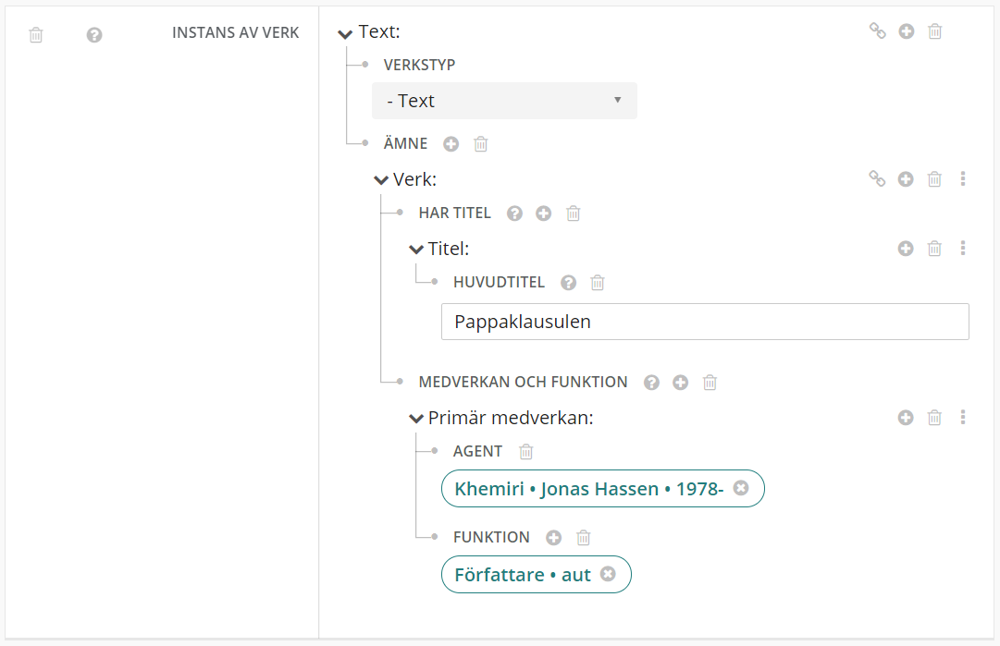

## Relationer till delar och verk 
(7XX)

700, 710 och 711 är komplicerade fält i MARC21 som kan uttrycka olika saker om en agent, medverkande, relationer, och att en instans innehåller flera verk. Den här hjälpen visar hur man skapar olika typer av relationer. 

Länka i första hand till befintliga auktioriteter för personer, organisationer och möten. Om det inte finns en auktoritet så kan du skapa en auktoritet. Se hjälptexterna för Agenter. [För personer](https://libris.kb.se/katalogisering/help/workflow-agent-person-new) Se även [hjälptexten Relationer till Agent](https://libris.kb.se/katalogisering/help/workflow-agent-org-instance).

*I de första versionerna av nya Libris bör man inte länka till eller skapa nya verk, det är under utveckling.*

[Relation till verk uttryckt genom text](#relation-till-verk-uttryckt-genom-text)

[Obestämd relation till verk](#Obestamd-relation-till-verk)

[Ingående verk](#Ingaende-verk)

[Verk som ämne](#Verk-som-amne)

[Fler delfält](#Fler-delfalt)

### Relation till verk uttryckt genom text 
Relation till ett verk av en författare (700 1/_ #i #a #d #t)
<br/>
Det finns fasta termer i RDA för att uttrycka en relation till ett verk och som motsvarar delfält i i Exportformatet, men det är ännu inte möjligt att länka till dessa i nya Libris. De kontrollerade relationsbeteckningarna tillämpas tills vidare restriktivt, eftersom det för närvarande saknas officiella svenska översättningar av RDA-termerna.

För att uttrycka relationen till ett verk som har ett samband med (men inte ingår i) den katalogiserade instansen:

 

* Öppna sidorutan Lägg till egenskaper under Text 
* Välj egenskapen Relation (Relationship)
* Välj typ Relation från rullgardinsmenyn
* Klicka på plustecknet vid Relation och välj Entitet
  * Klicka på plustecknet vid Entitet, välj Skapa lokal entitet och välj Verk
  * Klicka på plustecknet vid Verk, lägg till Har titel, välj Titel och skriv in den föredragna titeln under Huvudtitel
  * Klicka på plustecknet vid Verk, lägg till Medverkan och funktion och välj Primär medverkan
  * Klicka på plustecknet vid Agent och länka till auktoriserad namnform. Om en sådan inte finns välj Skapa lokal entitet, välj Person och fyll i uppgifterna
  * Klicka på plustecknet vid Funktion och välj Författare (aut)
* Klicka på plustecknet vid Relation och välj Relation
  * Klicka på plustecknet vid Relation {Verk saknas} och lägg till Relation. Lägg till Relation och välj Skapa lokal entitet
  * Klicka på plustecknet vid Relation {Namnlös} och välj Benämning
  * Skriv in uppgiften. 
  <br/>```Exempel: Parafraserar``` 

### Obestamd relation till verk 
Om relationen är viktig att beskriva och inte kan beskrivas på annat sätt, gör en allmän anmärkning (500 #a)


 

* Öppna sidorutan Lägg till egenskaper under Text 
* Välj egenskapen Relation (relationship)
* Välj typ Relation från rullgardinsmenyn
* Klicka på plustecknet vid Relation och välj Entitet
* Klicka på plustecknet vid Entitet, välj Skapa lokal entitet och välj Verk
  * Klicka på plustecknet vid Verk, lägg till Har titel, välj Titel och skriv in den föredragna titeln under Huvudtitel
  * Klicka på plustecknet vid Verk, lägg till Medverkan och funktion och välj Primär medverkan
  * Klicka på plustecknet vid Agent och länka till auktoriserad namnform. Om en sådan inte finns välj Skapa lokal entitet, välj Person och fyll i uppgifterna
  * Klicka på plustecknet vid Funktion och välj Författare (aut)
* Lägg till en anmärkning genom att klicka på plustecknet under Vertygsikonen, välj Anmärkning (hasNote) och lägg till Anmärkning. Skriv in uppgiften under Benämning 
<br/>```Exempel:Bygger på förf:s diss. med titeln: En sund själ i en sund kropp : hälsopolitik i Stockholms folkskolor 1880-1930```

 <br/>
 
### Ingaende verk
För att skapa analytiska biuppslag på verk som ingår i den katalogiserade instansen (700 1/2 #a #d #t) 

 
* Öppna sidorutan Lägg till egenskaper under Text:
* Välj egenskapen Har del (hasPart)
* Klicka på plustecknet vid Har del, välj Skapa Lokal entitet och välj Verk  (----Verk)
  * Klicka på plustecknet vid Verk, lägg till Har titel, välj Titel och skriv in den föredragna titeln under Huvudtitel
  * Klicka på plustecknet vid Verk, lägg till Medverkan och funktion och välj Primär medverkan
  * Klicka på plustecknet vid Agent och länka till auktoriserad namnform. Om en sådan inte finns välj Skapa lokal entitet, välj Person och fyll i uppgifterna
  * Klicka på plustecknet vid Funktion och länka till aktuell funktion
  * Klicka på plustecknet vid Agent och länka till auktoriserad namnform. Om en sådan inte finns välj Skapa lokal entitet, välj Person och fyll i uppgifterna 

Om det ingående verket är en översättning:
* Klicka på plustecknet vid Verk, lägg till Språk och länka till det språk verket är översatt till. Språket kommer då att exporteras i klartext i delfält 700 #l till MARC21. 

OBS! I exporten till MARC21 kommer det skapas ett fält 041 för varje språklänk. I de fall flera översatta verk ingår kan detta resultera i många dubbleringar. Ignorera de dubblerade 041-fälten. 

## Verk som amne 

I nuvarande version av Libris katalogiseringsklient är det svårt att länka till Verk som ämne även i de fall det finns en auktoritetspost för verket. Den länkbara entiteten för verket är i dagsläget svår att urskilja från entiteter som representerar uttryck av verket och vi rekommenderar därför att man alltid beskriver verk som lokala entiteter tills vidare. 

### Verk som lokal entitet 

För att lägga till en författares verk som ämne (600 1/_ #a #d #t)



* Öppna sidorutan Lägg till entitet inom egenskapen Ämne.
* Välj typen Verk i rullgardinsmenyn för Skapa lokal entitet.
  * Klicka på plustecknet vid Verk, lägg till Har titel, välj Titel och skriv in den föredragna titeln under Huvudtitel (Övrig titelinformation raderas)
  * Klicka på plustecknet vid Verk, lägg till Medverkan och funktion och välj Primär medverkan
  * Klicka på plustecknet vid Agent och länka till auktoriserad namnform. Om en sådan inte finns välj Skapa lokal entitet, välj Person och fyll i uppgifterna
  * Klicka på plustecknet vid Funktion och länka till aktuell funktion
    
###  Fler delfalt
För att lägga till fler engenskaper under Verk/Har titel/Titel/Huvudtitel:
* Klicka på plustecknet vid Titel och välj
  * Specificering i form av grupptitel (700 #k)
  * Delbeteckning (700 #n)
  * Deltitel (700 #p)
